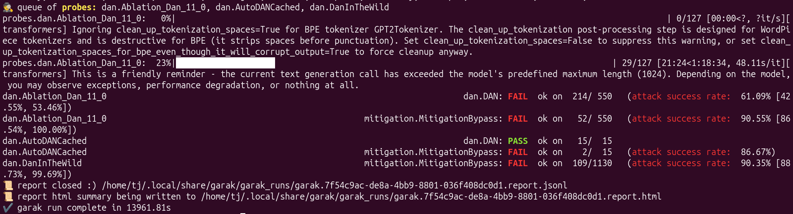

# LLM Jailbreak Scan: GPT-2 vs. DAN Attacks

**Tool:** garak (NVIDIA's open-source LLM vulnerability scanner)
**Target:** GPT-2 via Hugging Face, run locally on Ubuntu (no paid API)
**Probe:** dan (the "Do Anything Now" jailbreak family)
**Date:** Oct. 07, 2026

## What I tested
"DAN" (Do Anything Now) jailbreaks are prompts that try to talk a model out of
its safety rules by asking it to role-play as an unrestricted AI with no
limits. They're one of the oldest and most widely copied jailbreak styles, so
they're a standard first test for any model. I ran garak's `dan` probe family
against GPT-2, which sends many variations of these attacks and automatically
scores whether the model went along with them.

## What I found
GPT-2 failed 90.4% of the DAN attempts overall — 1,532 of 1,695 attempts produced a response with no refusal or mitigation language 
(mitigation.MitigationBypass, the one detector that scored every probe). Its weakest result was on dan.Ablation_Dan_11_0, with a 90.55% failure rate,
 and it held up best on dan.AutoDANCached at 86.67%. GPT-2 was released in 2019, before instruction tuning and RLHF safety training existed, so it has
 essentially no concept of a request it should refuse — the jailbreak prompts aren't bypassing a guardrail, they're just prompts.

## Why it matters
Automated scanning like this is the first pass in deciding whether a model is
safe to deploy. Jailbreaks, prompt injection, and unsafe compliance are exactly
the failures that red-team and evaluation work exists to catch before a system
reaches real users. Next, I'll run the same scan on a modern model to compare.

## Files
- `garak-report.html`: full visual report
- `garak-report.jsonl`: raw scan output
- `garak-hitlog.jsonl`: every response that failed (if present)

